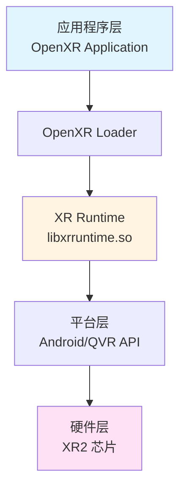
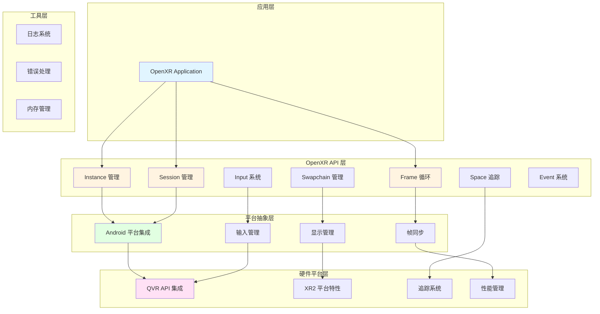

# 第1章：OpenXR Runtime 概述

## 1.1 OpenXR 规范简介

OpenXR 是由 Khronos Group 制定的开放标准，旨在为 VR/AR 应用提供跨平台的统一 API。OpenXR 规范定义了应用程序与 XR 运行时之间的标准接口，使得开发者可以编写一次代码，在多个 XR 平台上运行。

### OpenXR 的核心概念

- **Instance**: OpenXR 应用的入口点，代表应用程序与运行时的连接
- **Session**: 表示应用程序与 XR 系统的活动会话
- **Space**: 定义 3D 空间中的位置和方向
- **Swapchain**: 用于渲染图像的交换链
- **Action**: 用户输入动作的抽象表示

### OpenXR 的优势

1. **跨平台兼容性**: 一次开发，多平台运行
2. **标准化接口**: 统一的 API 设计
3. **扩展机制**: 支持平台特定的扩展
4. **向后兼容**: 版本升级保持兼容性

## 1.2 Runtime 的作用与地位

XR Runtime 是 OpenXR 架构中的核心组件，它充当应用程序与底层硬件平台之间的桥梁。

### Runtime 的主要职责

1. **API 实现**: 实现 OpenXR 规范定义的所有 API 函数
2. **资源管理**: 管理显示、追踪、输入等硬件资源
3. **平台抽象**: 将 OpenXR API 映射到底层平台 API
4. **性能优化**: 提供帧同步、延迟优化等性能特性

### Runtime 在架构中的位置

## 1.3 XRRuntime 框架架构设计

XRRuntime 采用分层架构设计，主要包含以下层次：

### 架构层次

1. **OpenXR API 层**
   - 实现 OpenXR 规范定义的所有 API
   - 参数验证和错误处理
   - API 函数导出

2. **平台抽象层**
   - Android 平台集成
   - 显示管理
   - 输入管理
   - 帧同步

3. **硬件平台层**
   - QVR API 集成
   - XR2 平台特性
   - 追踪系统
   - 性能管理

4. **工具层**
   - 日志系统
   - 错误处理
   - 内存管理

### 模块划分

- **openxr/**: OpenXR API 实现
- **platform/**: 平台抽象层
- **qualcomm/**: 高通平台集成
- **utils/**: 工具类
- **jni/**: JNI 桥接

## 1.4 高通 XR2 平台特性

高通 Snapdragon XR2 是专为 VR/AR 设备设计的移动平台芯片。

### XR2 平台特性

1. **6DOF 追踪**: 支持头部和控制器 6 自由度追踪
2. **高性能渲染**: 支持高分辨率、高帧率渲染
3. **眼动追踪**: 支持眼动追踪功能
4. **手势识别**: 支持手部追踪和手势识别
5. **空间感知**: 支持空间网格和遮挡

### QVR API

QVR (Qualcomm VR) API 是高通提供的 VR 平台 API，提供了：

- VR Mode 管理
- 头部追踪
- 控制器输入
- 显示配置
- 性能级别管理

## 1.5 本书学习路径

### 推荐学习路径

1. **基础阶段**（第1-2章）
   - 理解 OpenXR 和 Runtime 概念
   - 搭建开发环境

2. **构建阶段**（第3-5章）
   - 理解项目结构
   - 掌握编译方法
   - 验证输出产物

3. **实现阶段**（第6-14章）
   - 深入理解框架架构
   - 学习各模块实现
   - 掌握平台集成

4. **应用阶段**（第15-19章）
   - 学习库文件部署
   - 掌握 API 调用
   - 性能优化技巧

5. **高级阶段**（第20-23章）
   - 框架扩展设计
   - 测试与验证
   - 最佳实践

### 快速入门路径

如果只需要快速上手，可以重点关注：
- 第2章：环境准备
- 第4章：编译实践
- 第15章：运行时库文件部署
- 第18章：OpenXR API 调用实践

## 本章小结

本章介绍了 OpenXR 规范、Runtime 的作用、XRRuntime 框架架构以及高通 XR2 平台特性。这些基础知识为后续章节的学习奠定了基础。

## 延伸阅读

- [OpenXR 官方规范](https://www.khronos.org/registry/OpenXR/specs/1.1/html/xrspec.html)
- [Snapdragon XR SDK 文档](https://developer.qualcomm.com/software/snapdragon-xr-sdk)

