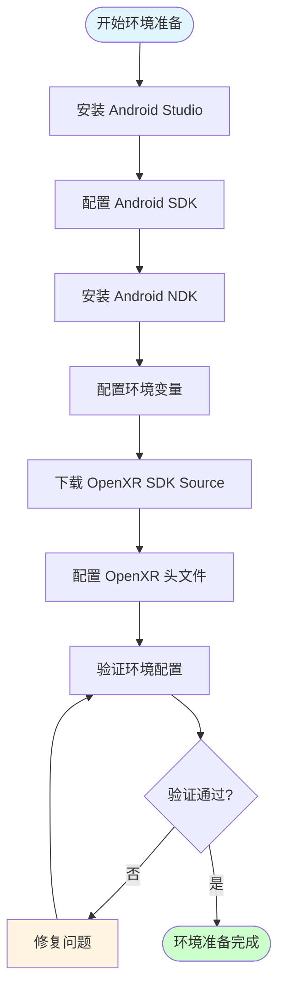
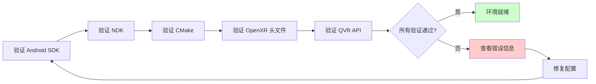

# 第2章：开发环境准备 - 引导图

## 环境搭建步骤引导图

```mermaid
flowchart TD
    Start([开始环境准备]) --> Step1[安装 Android Studio]
    Step1 --> Step2[配置 Android SDK]
    Step2 --> Step3[安装 Android NDK]
    Step3 --> Step4[配置环境变量]
    Step4 --> Step5[下载 OpenXR SDK Source]
    Step5 --> Step6[配置 OpenXR 头文件]
    Step6 --> Step7[验证环境配置]
    Step7 --> Check{验证通过?}
    Check -->|否| Fix[修复问题]
    Fix --> Step7
    Check -->|是| End([环境准备完成])
    
    style Start fill:#e1f5ff
    style End fill:#ccffcc
    style Fix fill:#fff4e1
```

## 配置验证流程

```mermaid
flowchart LR
    A[验证 Android SDK] --> B[验证 NDK]
    B --> C[验证 CMake]
    C --> D[验证 OpenXR 头文件]
    D --> E[验证 QVR API]
    E --> F{所有验证通过?}
    F -->|是| G[环境就绪]
    F -->|否| H[查看错误信息]
    H --> I[修复配置]
    I --> A
    
    style G fill:#ccffcc
    style H fill:#ffcccc
```

