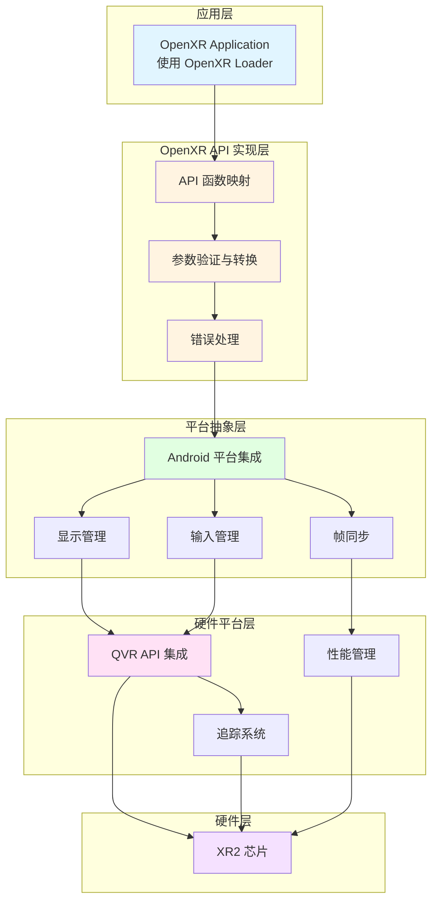
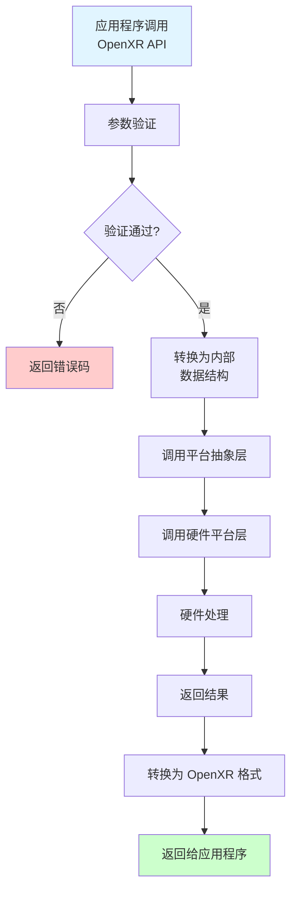
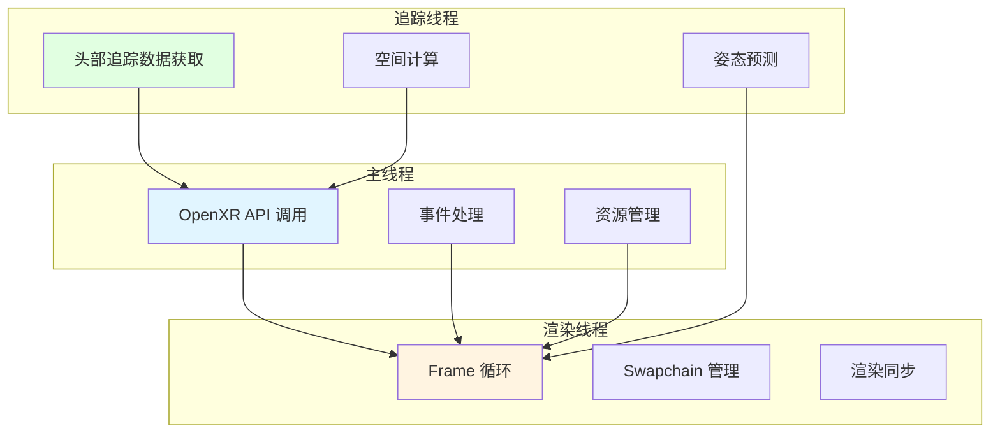

# 第6章：XRRuntime 框架架构设计

## 6.1 整体架构设计

### 分层架构模型

XRRuntime 采用清晰的分层架构，每一层都有明确的职责：



### 模块划分原则

#### 1. 按功能划分

- **openxr/**: OpenXR API 实现
  - `openxr_api.cpp/h`: API 函数导出
  - `instance.cpp`: Instance 管理
  - `session.cpp`: Session 管理
  - `frame.cpp`: Frame 循环
  - `space.cpp`: Space 管理
  - `swapchain.cpp`: Swapchain 管理
  - `input.cpp`: 输入系统
  - `event.cpp`: 事件系统

- **platform/**: 平台抽象层
  - `android_platform.cpp/h`: Android 平台集成
  - `display_manager.cpp/h`: 显示管理
  - `input_manager.cpp/h`: 输入管理
  - `frame_sync.cpp/h`: 帧同步

- **qualcomm/**: 高通平台集成
  - `xr2_platform.cpp/h`: XR2 平台接口
  - `qvr_api_wrapper.cpp/h`: QVR API 封装
  - `spaces_sdk_wrapper.cpp/h`: Spaces SDK 封装

- **utils/**: 工具类
  - `logger.cpp/h`: 日志系统
  - `error_handler.cpp/h`: 错误处理
  - `memory_manager.cpp/h`: 内存管理

- **jni/**: JNI 桥接
  - `jni_bridge.cpp/h`: JNI 接口

#### 2. 按职责划分

- **API 层**: 实现 OpenXR 规范
- **抽象层**: 屏蔽平台差异
- **实现层**: 具体平台实现
- **工具层**: 通用工具支持

### 接口设计规范

#### 命名规范

- OpenXR API 函数: 保持与规范一致（如 `xrCreateInstance`）
- 内部函数: 使用驼峰命名（如 `InitializeXRRuntime`）
- 结构体: 使用 `XR` 前缀（如 `XRInstance`）

#### 错误处理

所有函数都应返回 `XrResult` 类型，遵循 OpenXR 错误码规范：

```cpp
XrResult xrCreateInstance(const XrInstanceCreateInfo* createInfo, XrInstance* instance) {
    // 参数验证
    if (!createInfo || !instance) {
        return XR_ERROR_VALIDATION_FAILURE;
    }
    
    // 实现逻辑
    // ...
    
    return XR_SUCCESS;
}
```

## 6.2 OpenXR API 实现层

### API 函数映射机制

#### 函数导出

所有 OpenXR API 函数都通过 `extern "C"` 导出，确保 C 兼容性：

```cpp
extern "C" {
    XrResult xrCreateInstance(const XrInstanceCreateInfo* createInfo, XrInstance* instance);
    XrResult xrDestroyInstance(XrInstance instance);
    // ... 其他 API
}
```

#### 函数注册

在 `JNI_OnLoad` 中注册函数，使 OpenXR Loader 能够发现：

```cpp
JNIEXPORT jint JNICALL JNI_OnLoad(JavaVM* vm, void* reserved) {
    // 初始化 Runtime
    if (!InitializeXRRuntime()) {
        return JNI_ERR;
    }
    
    return JNI_VERSION_1_6;
}
```

### 参数验证与转换

#### 参数验证

每个 API 函数都应进行参数验证：

```cpp
XrResult xrCreateInstance(const XrInstanceCreateInfo* createInfo, XrInstance* instance) {
    // 1. 空指针检查
    if (!createInfo || !instance) {
        return XR_ERROR_VALIDATION_FAILURE;
    }
    
    // 2. 版本检查
    if (createInfo->type != XR_TYPE_INSTANCE_CREATE_INFO) {
        return XR_ERROR_VALIDATION_FAILURE;
    }
    
    // 3. API 版本检查
    if (createInfo->applicationInfo.apiVersion > XR_CURRENT_API_VERSION) {
        return XR_ERROR_API_VERSION_UNSUPPORTED;
    }
    
    // 4. 实现逻辑
    // ...
}
```

#### 数据转换

在平台抽象层进行数据格式转换：

```cpp
// OpenXR 格式 -> QVR 格式
bool ConvertOpenXRToQVR(const XrPosef& openxrPose, QVRPose& qvrPose) {
    // 位置转换
    qvrPose.posx = openxrPose.position.x;
    qvrPose.posy = openxrPose.position.y;
    qvrPose.posz = openxrPose.position.z;
    
    // 旋转转换（四元数）
    qvrPose.rotx = openxrPose.orientation.x;
    qvrPose.roty = openxrPose.orientation.y;
    qvrPose.rotz = openxrPose.orientation.z;
    qvrPose.rotw = openxrPose.orientation.w;
    
    return true;
}
```

### 错误处理机制

#### 错误码映射

将平台特定错误转换为 OpenXR 错误码：

```cpp
XrResult ConvertQVRErrorToOpenXR(int qvrError) {
    switch (qvrError) {
        case QVR_SUCCESS:
            return XR_SUCCESS;
        case QVR_ERROR_NOT_INITIALIZED:
            return XR_ERROR_INSTANCE_LOST;
        case QVR_ERROR_INVALID_PARAMETER:
            return XR_ERROR_VALIDATION_FAILURE;
        default:
            return XR_ERROR_RUNTIME_FAILURE;
    }
}
```

#### 错误日志

记录错误信息便于调试：

```cpp
#define LOG_ERROR(result, message) \
    do { \
        LOG(ERROR) << "OpenXR Error: " << #result << " - " << message; \
    } while(0)

XrResult xrCreateInstance(...) {
    // ...
    if (error) {
        LOG_ERROR(XR_ERROR_RUNTIME_FAILURE, "Failed to create instance");
        return XR_ERROR_RUNTIME_FAILURE;
    }
}
```

## 6.3 平台抽象层设计

### Android 平台抽象

#### JNI 环境管理

```cpp
// android_platform.h
JavaVM* GetJavaVM();
void SetJavaVM(JavaVM* vm);
JNIEnv* GetJNIEnv();
```

#### Native Window 管理

```cpp
ANativeWindow* GetNativeWindow();
void SetNativeWindow(ANativeWindow* window);
```

#### EGL 上下文管理

```cpp
EGLDisplay GetEGLDisplay();
EGLContext GetEGLContext();
EGLSurface GetEGLSurface();
```

### 硬件平台抽象

#### XR2 平台接口

```cpp
// xr2_platform.h
bool InitializeXR2Platform();
void ShutdownXR2Platform();

// 显示管理
bool GetXR2DisplayProperties(uint32_t* width, uint32_t* height, ...);

// 追踪
bool GetXR2ViewPoses(XrTime time, XrSpace space, XrView* views, ...);

// 输入
bool GetXR2BooleanInput(XrAction action, XrPath subactionPath, bool* state, ...);
```

### 跨平台兼容性设计

#### 条件编译

使用预处理器指令支持多平台：

```cpp
#ifdef ANDROID
    #include "android_platform.h"
#elif defined(LINUX)
    #include "linux_platform.h"
#endif
```

#### 平台特性检测

```cpp
bool IsPlatformSupported() {
#ifdef ANDROID
    return CheckAndroidVersion();
#else
    return false;
#endif
}
```

## 6.4 数据流设计

### 请求处理流程

#### API 调用流程



#### 示例：xrCreateInstance 流程

```cpp
XrResult xrCreateInstance(...) {
    // 1. 参数验证
    ValidateCreateInfo(createInfo);
    
    // 2. 创建内部 Instance 对象
    XRInstance* instance = new XRInstance();
    
    // 3. 初始化平台
    if (!InitializeAndroidPlatform()) {
        delete instance;
        return XR_ERROR_RUNTIME_FAILURE;
    }
    
    // 4. 初始化 XR2 平台
    if (!InitializeXR2Platform()) {
        ShutdownAndroidPlatform();
        delete instance;
        return XR_ERROR_RUNTIME_FAILURE;
    }
    
    // 5. 返回 Instance 句柄
    *instance = reinterpret_cast<XrInstance>(instance);
    return XR_SUCCESS;
}
```

### 事件传递机制

#### 事件队列

使用队列管理异步事件：

```cpp
class EventQueue {
private:
    std::queue<XrEventDataBuffer> events_;
    std::mutex mutex_;
    
public:
    void PushEvent(const XrEventDataBuffer& event) {
        std::lock_guard<std::mutex> lock(mutex_);
        events_.push(event);
    }
    
    bool PopEvent(XrEventDataBuffer* event) {
        std::lock_guard<std::mutex> lock(mutex_);
        if (events_.empty()) {
            return false;
        }
        *event = events_.front();
        events_.pop();
        return true;
    }
};
```

#### 事件生成

平台层生成事件并推送到队列：

```cpp
void OnSessionStateChanged(XrSessionState state) {
    XrEventDataSessionStateChanged event = {};
    event.type = XR_TYPE_EVENT_DATA_SESSION_STATE_CHANGED;
    event.session = session_;
    event.state = state;
    event.time = GetCurrentTime();
    
    eventQueue_.PushEvent(reinterpret_cast<XrEventDataBuffer&>(event));
}
```

### 线程模型设计



#### 主线程

- OpenXR API 调用
- 事件处理
- 资源管理

#### 渲染线程

- Frame 循环
- Swapchain 管理
- 渲染同步

#### 追踪线程（可选）

- 头部追踪数据获取
- 姿态预测
- 空间计算

#### 线程同步

使用互斥锁保护共享资源：

```cpp
class XRSession {
private:
    std::mutex state_mutex_;
    XrSessionState state_;
    
public:
    void SetState(XrSessionState newState) {
        std::lock_guard<std::mutex> lock(state_mutex_);
        state_ = newState;
    }
    
    XrSessionState GetState() {
        std::lock_guard<std::mutex> lock(state_mutex_);
        return state_;
    }
};
```

## 本章小结

本章介绍了 XRRuntime 框架的整体架构设计，包括分层架构模型、模块划分原则、接口设计规范以及数据流和线程模型。理解这些设计原则对于后续章节的学习非常重要。

## 下一步

- [第7章：Instance 管理实现](chapter07.md)

