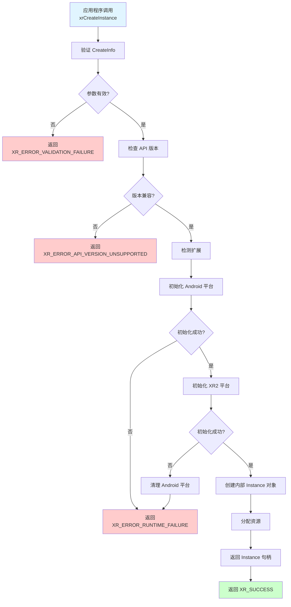

# 第7章：Instance 管理实现

## 7.1 Instance 创建机制

### Instance 创建流程图

### xrCreateInstance 实现

Instance 是 OpenXR 应用的入口点，代表应用程序与运行时的连接。

#### 实现要点

- 参数验证
- 扩展检测与启用
- 平台初始化
- 资源分配

### 扩展检测与启用

#### 支持的扩展

- `XR_KHR_android_create_instance` - Android 平台支持
- `XR_KHR_opengl_es_enable` - OpenGL ES 图形支持
- `XR_KHR_vulkan_enable` - Vulkan 图形支持（可选）

### 初始化流程

1. 验证创建信息
2. 检测并启用扩展
3. 初始化 Android 平台
4. 初始化 XR2 平台
5. 创建内部 Instance 对象

## 7.2 Instance 生命周期管理

### 资源分配

Instance 创建时需要分配的资源：
- 内部状态对象
- 平台资源
- 扩展资源

### 状态管理

Instance 的状态包括：
- 已创建
- 已初始化
- 已销毁

### 销毁流程

`xrDestroyInstance` 实现：
1. 检查 Instance 有效性
2. 清理所有关联资源
3. 关闭平台连接
4. 释放内存

## 7.3 系统信息获取

### xrGetSystem 实现

获取系统信息，包括：
- System ID
- 系统属性
- 支持的视图配置

### 系统能力查询

查询系统能力：
- 显示属性
- 追踪能力
- 输入支持

### 属性信息管理

管理 Instance 和 System 属性信息。

## 本章小结

本章介绍了 Instance 管理的实现，包括创建、生命周期管理和系统信息获取。

## 下一步

- [第8章：Session 管理实现](chapter08.md)

