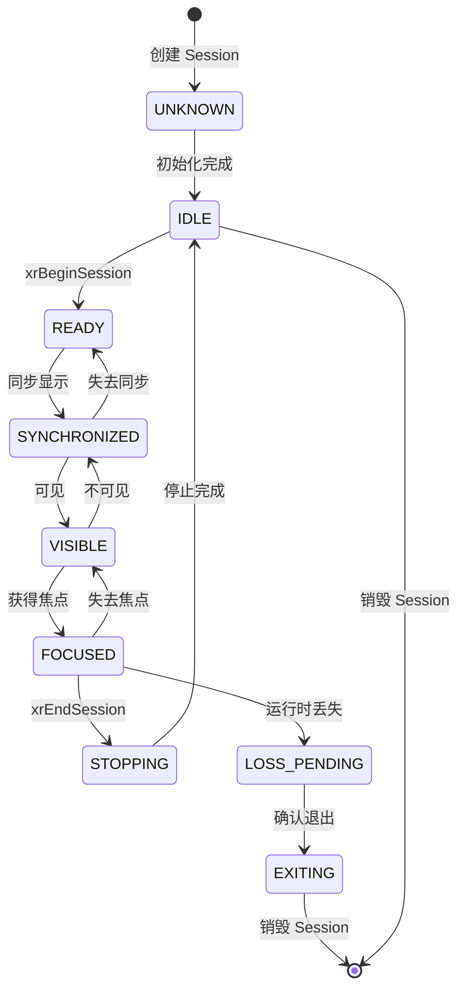

# 第8章：Session 管理实现

## 8.1 Session 创建与配置

### xrCreateSession 实现

Session 表示应用程序与 XR 系统的活动会话。

#### 实现要点

- 图形 API 绑定
- 视图配置选择
- 资源初始化

### 图形 API 绑定

#### OpenGL ES 绑定

```cpp
XrGraphicsBindingOpenGLESAndroidKHR glBinding = {};
glBinding.type = XR_TYPE_GRAPHICS_BINDING_OPENGL_ES_ANDROID_KHR;
glBinding.display = eglDisplay;
glBinding.config = eglConfig;
glBinding.context = eglContext;
```

### 视图配置选择

选择支持的视图配置类型：
- `XR_VIEW_CONFIGURATION_TYPE_PRIMARY_STEREO` - 主要立体视图

## 8.2 Session 状态机

### Session 状态转换图



### 状态转换流程

Session 状态包括：
- `XR_SESSION_STATE_UNKNOWN`
- `XR_SESSION_STATE_IDLE`
- `XR_SESSION_STATE_READY`
- `XR_SESSION_STATE_SYNCHRONIZED`
- `XR_SESSION_STATE_VISIBLE`
- `XR_SESSION_STATE_FOCUSED`
- `XR_SESSION_STATE_STOPPING`
- `XR_SESSION_STATE_LOSS_PENDING`
- `XR_SESSION_STATE_EXITING`

### xrBeginSession/xrEndSession

#### xrBeginSession

开始 Session，进入运行状态。

#### xrEndSession

结束 Session，清理资源。

### 状态同步机制

确保状态转换的正确性和线程安全。

## 8.3 Session 生命周期回调

### 事件通知机制

Session 状态变化时生成事件并通知应用程序。

### 资源清理

Session 销毁时清理：
- Swapchain
- Space
- Action Set
- 图形资源

### 错误恢复

处理 Session 丢失等错误情况。

## 本章小结

本章介绍了 Session 管理的实现，包括创建、状态管理和生命周期回调。

## 下一步

- [第9章：Frame 循环实现](chapter09.md)

