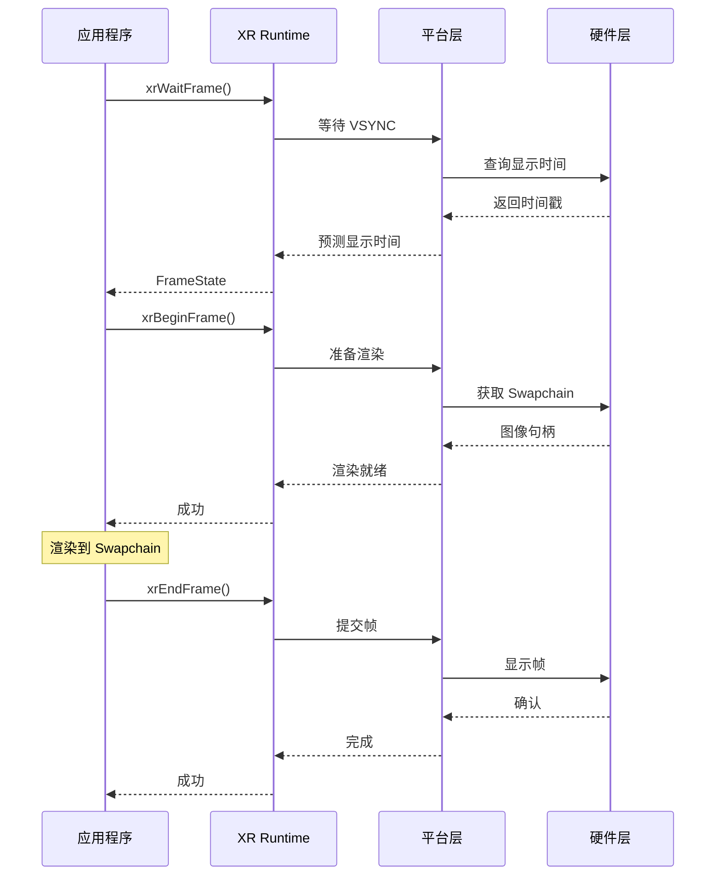

# 第9章：Frame 循环实现

## 9.1 Frame 同步机制

### xrWaitFrame 实现

等待下一帧的渲染时机。

#### 实现要点

- VSYNC 同步
- 帧时间预测
- 延迟补偿

### VSYNC 同步

与显示器的垂直同步信号同步，确保帧率稳定。

### 帧率控制

控制帧率在目标范围内（通常 72Hz 或 90Hz）。

## 9.2 帧渲染流程

### 帧渲染流程图

### xrBeginFrame 实现

开始帧渲染，准备渲染资源。

#### 渲染准备

- 获取预测显示时间
- 准备视图数据
- 获取 Swapchain 图像

### xrEndFrame 实现

提交帧，完成渲染。

#### 提交内容

- 渲染层
- 显示时间
- 视图配置

## 9.3 性能优化

### 帧时间预测

预测下一帧的显示时间，用于延迟补偿。

### 延迟优化

- 异步时间扭曲
- 预测性追踪
- 多线程渲染

### CPU/GPU 负载均衡

合理分配 CPU 和 GPU 的工作负载。

## 本章小结

本章介绍了 Frame 循环的实现，包括同步机制、渲染流程和性能优化。

## 下一步

- [第10章：追踪系统实现](chapter10.md)

